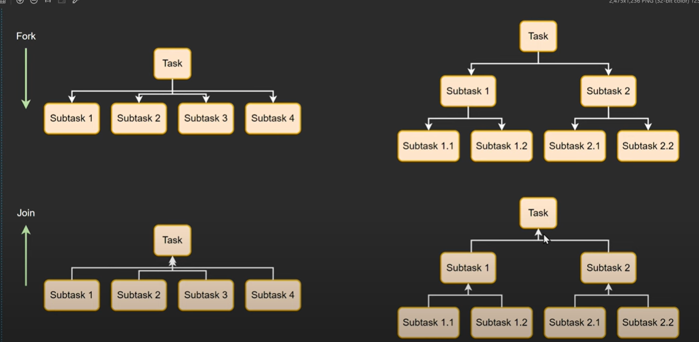

# accelerator-AL
A. Java Reflection and Annotations 

B. Java NIO (Non-Blocking I/O) 
C. Concurrency Advanced Topics (e.g., Fork/Join Framework, Executors)

D. Distributed Systems & Big Data (e.g., Apache Spark) 

E. Java Memory Model (JMM)

##
1. Fork/Join Framework

    The Fork/Join Framework in Java is a powerful tool for parallel processing of 
    recursive tasks. It leverages the "divide-and-conquer" approach where a large task is 
    broken down into smaller, independent subtasks. These subtasks can be further 
    divided recursively until they become simple enough to be executed directly on 
    multiple cores of a CPU, achieving faster execution times

- Underlying concept

    - 

    - We want to use the CPU efficiently
        - work stealing
         - if a particular task is taking too long to be executed by a particular thread. Other Idle threads can steal from the tail end of the queue. Good for mutiple CPUs
            -    

    - Note
        - if you want to breakdown a task into multiple taks
        - if you dont need to return a result
        - if you want to leverage multiple CPU cores
            - use `RecursiveAction`

- Task
    -  #1: Parallel Fibonacci Calculation with Fork/Join Framework
        - F(n) = F(n-1) + F(n-2), where F(0) = 0 and F(1) = 1