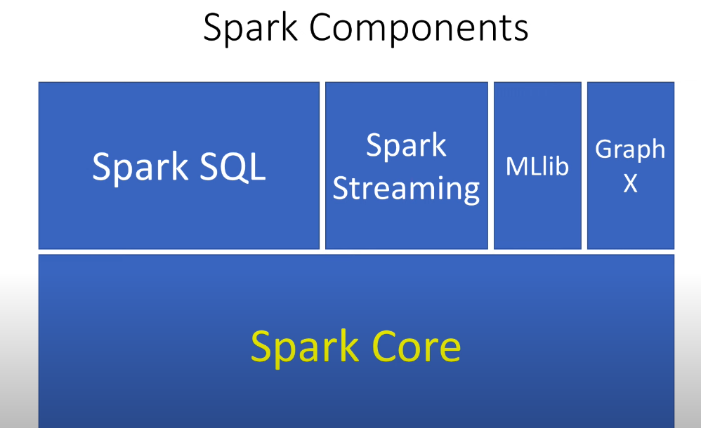

# accelerator-AL
A. Java Reflection and Annotations 

B. Java NIO (Non-Blocking I/O) 
C. Concurrency Advanced Topics (e.g., Fork/Join Framework, Executors)

D. Distributed Systems & Big Data (e.g., Apache Spark) 

E. Java Memory Model (JMM)

---

## 1. Fork/Join Framework

    The Fork/Join Framework in Java is a powerful tool for parallel processing of 
    recursive tasks. It leverages the "divide-and-conquer" approach where a large task is 
    broken down into smaller, independent subtasks. These subtasks can be further 
    divided recursively until they become simple enough to be executed directly on 
    multiple cores of a CPU, achieving faster execution times


- Underlying concept

    - 

    - We want to use the CPU efficiently
        - work stealing
         - if a particular task is taking too long to be executed by a particular thread. Other Idle threads can steal from the tail end of the queue. Good for mutiple CPUs
            -    

    - Note
        - if you want to breakdown a task into multiple taks
        - if you dont need to return a result
        - if you want to leverage multiple CPU cores
            - use `RecursiveAction`


- Task
    -  #1: Parallel Fibonacci Calculation with Fork/Join Framework
        - `F(n) = F(n-1) + F(n-2), where F(0) = 0 and F(1) = 1`
        - comoutung the Fibo seq for large numbers can be computationally expensive
        - We can parallelize the task braking it down into smaller subproblems - with the help of the ForkJoin

    - Matrix Multiplication Task
        - Matrix Multiplication (A x B = C)
            - `A` is `m` x `n`
            - `B` is `n` x `p`
            - result `C` = `m` x `p`
                - each element `c[i][j]` = dot product of row i in `A` and column j in `B`
        - we will be using ForkJoin Framework to mulitply two matrices
        - using the block(quadrant) method [https://en.wikipedia.org/wiki/Matrix_multiplication_algorithm](https://en.wikipedia.org/wiki/Matrix_multiplication_algorithm)

        - split `A`, `B` and `C` into 4 equal-sized submatrices
        - perform 8 sub matix multiplications (forked)
        - sum results into `C`

    - lets assume each matix is n x n (square, power of 2)
        - here's how they're split

```
Matrix A:              Matrix B:               Result C:
+------+-------+       +------+-------+       +------+-------+
| A11  | A12   |       | B11  | B12   |       | C11  | C12   |
+------+-------+       +------+-------+       +------+-------+
| A21  | A22   |       | B21  | B22   |       | C21  | C22   |
+------+-------+       +------+-------+       +------+-------+

```

- the math is 

```
C11 = A11*B11 + A12*B21
C12 = A11*B12 + A12*B22
C21 = A21*B11 + A22*B21
C22 = A21*B12 + A22*B22

```

- we use a temp matrix `T` to store the second part(`A12*B21`)
- then add to `C`

- What is the base case? (`MatrixMultiplyBase`)
    - matrix block is small enough `(<= threshold)`
        - then we use normal loop multiplication
- What is the recursive case? (`MatrixMultiplyTask`)
    - split into quadrants
    - fork 8 multiplications
    - then fork 4 additions


- Steps
    - 1 : `SubMatix`
    - 2 : `MatrixMultiplyBase` extends  `RecursiveAction`
    - 3 : `MatrixMultiplyTask` extends `RecusrsiveAction`
    - 4 : `MatrixAddTask` extends `RecursiveAction`   :: Task to add two submatrices element-wise


---

## 2. Concurrency Essentials: Java NIO (Non-Blocking I/O)
- Key Concepts
    - `Buffer`
        - Containers for data
        - Data is read from channels into buffers
        - Data is written from Buffers to Channels

    - `Channels`
        - like streams
        - can read and write simultaneously

    - `Selectors`
        - monitor mulitpile Channels

    - `Path`
        - files / directory path

```java

// testing the idea
public class App {
    static void NIOFileReader(){
        try {
            // Get the file from the resources folder
            Path filePath = Paths.get(App.class.getClassLoader().getResource("example.txt").toURI());
            System.out.println("Reading file: " + filePath);
            // Read and print each line using NIO
            Files
                .lines(filePath)
                .forEach(System.out::println);

        } catch (IOException e) {
            System.err.println("Error reading the file: " + e.getMessage());
            e.printStackTrace();
        } catch (Exception e) {
            System.err.println("Error locating the file: " + e.getMessage());
            e.printStackTrace();
        }
    }
    public static void main(String[] args) {
        App.NIOFileReader();
        System.out.println("... done");

    }
}


```

 - simple read with NIO

```java
    static void NIOSampleReader(){
        // ✅ File to read from
        Path path = Paths.get("src/main/resources/example.txt");

        // ✅ Open the file channel in read-only mode
        try(FileChannel fileChannel = FileChannel.open(path, StandardOpenOption.READ)){

            // ✅ Allocate a byte buffer
            ByteBuffer buffer = ByteBuffer.allocate(1024);
            int bytesRead;
            do{
                bytesRead = fileChannel.read(buffer);
                if(bytesRead > 0){
                    // Flip the buffer to prepare for reading
                    buffer.flip();

                    // ✅ Process and print the read data
                    System.out.println(new String(buffer.array(), 0, bytesRead));

                    // ✅ Clear the buffer for next read
                    buffer.clear();
                }

            }while(bytesRead > 0); // Continue until EOF (read returns -1)

        }catch (IOException e){
            e.printStackTrace();
        }

    }

```

```text


+----------------+         +-------------+         +---------------+
| "data.txt"     | ----->  | FileChannel | ----->  | ByteBuffer     |
+----------------+         +-------------+         +---------------+
       ⬇                        ⬇                         ⬇
    Reads file            Reads bytes                Holds data temporarily
                       into buffer (up to 1024)       for processing


```

- `FileChannel`
    - Used instead of InputStream for more efficient I/O.
- `flip`
    - Optional if you're using .array(), but required if using .get() or other buffer read ops. 

#### Exercise 1: Modify the code to write data to a file using NIO.
- Solution
    - [./nio/Ex1.java](./nio/Ex1.java)

#### Exercise 2 (Advanced): Implement a simple file copier program using NIO. The program should copy the contents of one file to another.
- Solution
    - [./nio/Ex2.java](./nio/Ex2.java)

---

## 3. Reflection and Annotations
- Reflection: introspecting and manipulating code behaviours at runtime
- Annotations: metadata attached to program elements
#### Exercise 1: Create a custom annotation @LogExecutionTime to log the execution time of a method.
- Solution
    - [./reflec_anno/Ex1.java](./reflec_anno/Ex1.java)
#### Exercise 2 (Advanced): Implement a class loader that can load classes from a custom directory at runtime using reflection.
- Solution
    - [./reflec_anno/Ex2.java](./reflec_anno/Ex2.java)


## 4. Distributed Systems & Big Data (e.g., Apache Spark)


- [./distri_sys_big_data/README.md](./distri_sys_big_data/README.md)


