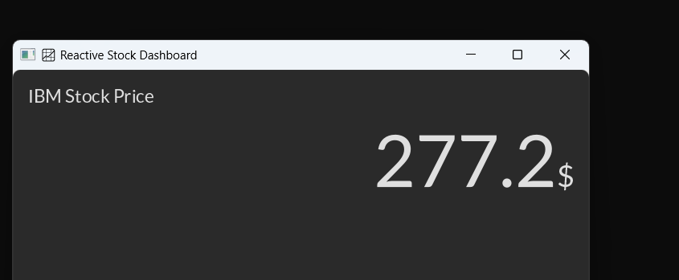
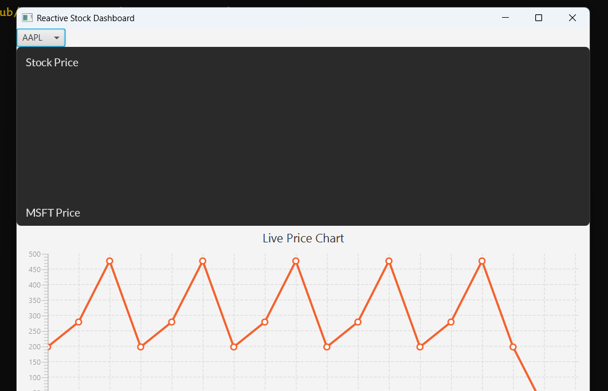

# 📈 Reactive Stock Viewer (RxJava + JavaFX) 💹

Welcome to the **Reactive Stock Viewer** project! This repository contains **two awesome JavaFX apps** that help you track stock prices with style and reactivity using **RxJava 3**, **Retrofit**, and **JavaFX 21**.

## 🛠️ Tech Stack
- Java 21 ☕
- JavaFX 21 🎨
- RxJava 3 🔁
- Retrofit 2 🌐
- Gson 🧠
- Alpha Vantage API 📊

---

## 📘 Project 1: IBM Stock Tracker (Reactive Style) 🧪

A clean and focused app that uses **RxJava** to fetch **IBM's live stock data** from the Alpha Vantage API every 15 seconds.

### 🧠 How It Works
- Uses RxJava's `Observable.interval()` to fetch data periodically.
- Retrofit interfaces with Alpha Vantage API and parses JSON using Gson.
- JavaFX UI updates reactively every time new data arrives.

### ✨ RxJava in Action
```java
Observable.interval(0, 15, TimeUnit.SECONDS)
    .flatMapSingle(tick -> stockPriceFetcher.fetch())
    .observeOn(JavaFxScheduler.platform())
    .subscribe(response -> updateUI(response.getGlobalQuote()));

```

### 🖥️ UI Features
- 💹 IBM stock price updates in real time
- 📆 Last updated timestamp
- 💡 Reactive updates using RxJava
- 💥 Clean JavaFX GUI with controlsfx & bootstrapfx


### 📸 Screenshot



## (branch: multiple options) 🚀 Project 2: Live Stock Dashboard 📊🧠
- An upgraded, real-time multi-stock visualizer supporting:
  - IBM 🧠 
  - AAPL 🍏 
  - GOOGL 🔍 
  - TSLA ⚡

### 🎯 Highlights
- Live updating line charts using TilesFX 
- Periodic background updates with RxJava 
- Modern, dashboard-like design with multiple Tiles showing:
  - Current price 
  - Trend lines 
  - High, Low, Volume

### 📦 Dependencies
- TilesFX for dashboards 
- Retrofit for HTTP calls
- RxJava 3 for reactive background tasks
- Gson for parsing responses
- JavaFX for GUI

### 📈 Live Chart View
- Each stock tile shows:
  - 🔺 Price movement 
  - ⏱️ Last update 
  - 🟢 Green if rising, 🔴 Red if falling



### 🔐 API Key
- Don't forget to get your free API key from Alpha Vantage
- Save it in your environment or inject directly for testing:
```java
String apiKey = "YOUR_API_KEY";

```

### 💡 Tips
- If you're using Java 9+, make sure to open your module for Gson:
```java
opens org.example.prjstockprice to gson;

```
- In the "VM options" field, add:
  - `--add-modules javafx.controls,javafx.fxml,java.sql`

#### 📜 License
Feel free to fork and build your own stock dashboard!

