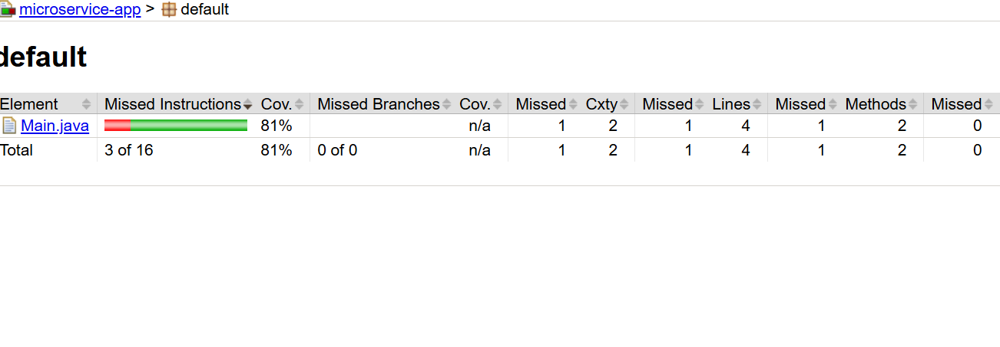

# Java Maven Microservice Project
This is a simple multi-module Maven project built to explore 
key aspects of microservice structuring and Maven’s advanced capabilities.

```text
microservice-parent/
├── microservice-core   → Core business logic
├── microservice-data   → Data access logic
├── microservice-app    → Entry point and testable logic
```

### 🔧 Exercise 1.1 – Setting Up Maven Build
- Goal: Learn how to organize a multi-module Maven-based microservice.
✅ Used a parent pom.xml to manage shared configuration.
✅ Defined modules:
  - core: Basic logic and utilities. 
  - data: Repository layer with fake/mock order data. 
  - app: Contains the Main class and unit tests.
✅ Dependency flow:
    - microservice-app depends on core and data.

### 🧪 Exercise 1.2 – Advanced Maven Features
- Goal: Use advanced Maven features like plugins for testing, code coverage, and quality assurance.
✅ JaCoCo Plugin 
  - Added JaCoCo in microservice-app to generate code coverage reports.
```java
mvn clean verify

:: do this at the microservice parent dir
```
- Generated HTML coverage report:
```java
microservice-app/target/site/jacoco/index.html
```

