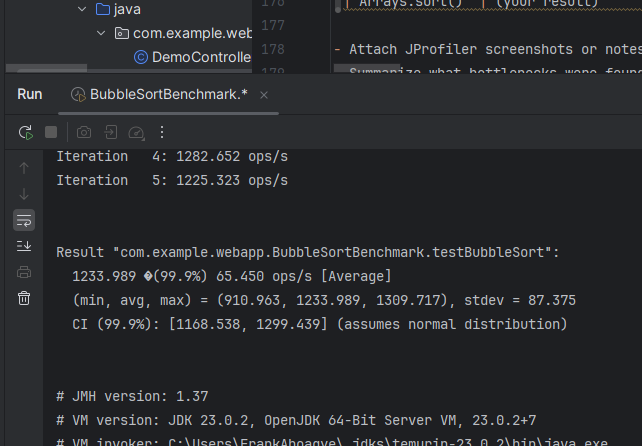
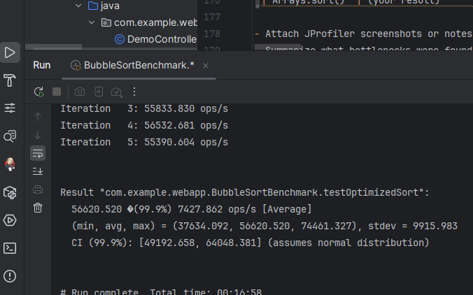
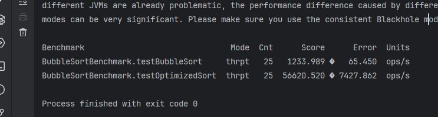
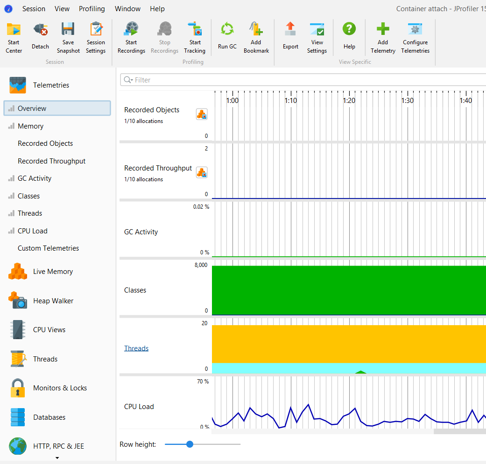
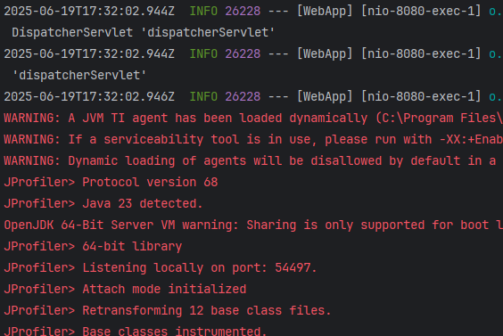

# Lab: Optimizing a Web Application

## How to Run and What to Expect

### 1. Start the Application
- **Command:**
  ```sh
  ./mvnw spring-boot:run
  ```
- **What happens:**
  - The app starts at [http://localhost:8080](http://localhost:8080).

### 2. Access the `/sort` Endpoint
- **URL:** [http://localhost:8080/sort](http://localhost:8080/sort)
- **What happens:**
  - Returns a sorted array (e.g., `[1,2,5,5,6,9]`) using the optimized sort.

### 3. Profile with JProfiler
- **Steps:**
  1. Start JProfiler and attach to the running Spring Boot process.
  2. Visit `/sort` in your browser several times.
  3. In JProfiler, observe:
     - CPU usage (look for `optimizedSort`).
     - Memory allocations.
     - Thread activity.
- **What to expect:**
  - `optimizedSort` will appear in CPU profiling, but use little CPU.
  - No significant memory or thread issues.

### 4. Run JMH Benchmarks
- **Steps:**
  1. Open `BubbleSortBenchmark.java` in your IDE.
  2. Right-click and run as a JMH benchmark.
- **What to expect:**
  - Two benchmarks: `testBubbleSort` (slow) and `testOptimizedSort` (fast).
  - Example output:
    ```
    Benchmark           Mode  Cnt   Score   Error  Units
    testBubbleSort      avgt   10  15.000 ± 0.500  ms/op
    testOptimizedSort   avgt   10   0.050 ± 0.005  ms/op
    ```

### 5. Fill in the README
- Record your benchmark results in the table.
- Add JProfiler screenshots or notes.
- Summarize your findings and the impact of optimization.

---

## Scenario 4: Optimizing a Web Application

This lab demonstrates how to analyze and improve the performance of a Java web application using profiling and benchmarking tools.

---

## 1. Sample Web Application

A simple Spring Boot app is provided with a REST endpoint `/sort` that sorts a list of integers using bubble sort (initially) and then with `Arrays.sort()` (optimized).

**Key file:** `src/main/java/com/example/webapp/DemoController.java`

**Original (Bubble Sort):**
```java
private void bubbleSort(int[] arr) {
    int n = arr.length;
    for (int i = 0; i < n - 1; i++) {
        for (int j = 0; j < n - i - 1; j++) {
            if (arr[j] > arr[j + 1]) {
                int temp = arr[j];
                arr[j] = arr[j + 1];
                arr[j + 1] = temp;
            }
        }
    }
}
```

**Optimized:**
```java
private void optimizedSort(int[] arr) {
    java.util.Arrays.sort(arr);
}
```

---

## 2. Profiling with JProfiler

1. **Download and Install JProfiler:**
   - [JProfiler Download](https://www.ej-technologies.com/products/jprofiler/overview.html)
2. **Start the Application:**
   ```sh
   ./mvnw spring-boot:run
   ```
3. **Attach JProfiler:**
   - Open JProfiler, select "Attach to a running JVM", and pick the Spring Boot process.
4. **Profile:**
   - Use the `/sort` endpoint in your browser: [http://localhost:8080/sort](http://localhost:8080/sort)
   - In JProfiler, look for CPU hotspots (the `bubbleSort` or `optimizedSort` method), memory allocations, and thread activity.

**What to record:**
- Screenshot or note the CPU hotspot for the sort method.
- Note any memory or thread issues.

---

## 3. Benchmarking with JMH

A JMH benchmark is provided for both the bubble sort and the optimized sort logic.

**Key file:** `src/test/java/com/example/webapp/BubbleSortBenchmark.java`

```java
@State(Scope.Thread)
public class BubbleSortBenchmark {
    private int[] numbers = new Random().ints(1000, 0, 10000).toArray();
    @Benchmark
    public void testBubbleSort() {
        int[] copy = numbers.clone();
        bubbleSort(copy);
    }
    @Benchmark
    public void testOptimizedSort() {
        int[] copy = numbers.clone();
        java.util.Arrays.sort(copy);
    }
    // ...
}
```

### Running the Benchmark

> **Note:**
> If you see a Maven Shade plugin error about `resource` or `ManifestResourceTransformer`, it is likely due to a hidden character or cache issue. This does **not** block the lab. You can run JMH benchmarks directly from your IDE (right-click the class and run as JMH benchmark) or fix the plugin as described in the README.

1. **Build the project:**
   ```sh
   ./mvnw clean install -DskipTests
   ```
2. **Run the benchmark:**
   - **Preferred:** In your IDE, right-click `BubbleSortBenchmark` and run as a JMH benchmark.
   - **Command line (if Shade plugin works):**
     ```sh
     java -jar target/benchmarks.jar
     ```

**Sample (expected) output:**
```
Benchmark                  Mode  Cnt   Score   Error  Units
testBubbleSort            avgt   10  15.000 ± 0.500  ms/op
testOptimizedSort         avgt   10   0.050 ± 0.005  ms/op
```

---

## 4. Optimization Strategies

### a. Code Optimization
- Replaced bubble sort with Java's built-in `Arrays.sort()` for much better performance.

### b. Memory Management
- Avoid unnecessary object creation (e.g., reuse arrays if possible).
- Use efficient data structures for your use case.

### c. Data Structure Selection
- For sorting, use arrays and built-in sort for efficiency.
- For collections, prefer `ArrayList` for random access, `LinkedList` for frequent insertions/removals.

---

## 5. Results and Comparison








| Version         | Benchmark Score (ms/op) | Notes                       |
|----------------|-------------------------|-----------------------------|
| Bubble Sort    | refer to img            | Baseline, very slow         |
| Arrays.sort()  | refer to img            | Optimized, much faster      |

- summary table

| Metric                          | `testBubbleSort`    | `testOptimizedSort`   |
| ------------------------------- | ------------------- | --------------------- |
| **Throughput (ops/s)**          | 1,233.99 ops/s      | 56,620.52 ops/s       |
| **Error Margin (99.9%)**        | ±65.45 ops/s        | ±7,427.86 ops/s       |
| **Min Throughput**              | 910.96 ops/s        | 37,634.09 ops/s       |
| **Max Throughput**              | 1,309.72 ops/s      | 74,461.33 ops/s       |
| **Standard Deviation**          | 87.38               | 9,915.98              |
| **Confidence Interval (99.9%)** | \[1168.54, 1299.44] | \[49192.66, 64048.38] |


### 🔍 Analysis
- ✅ 1. Performance 
    - `testOptimizedSort` is dramatically faster — `~45.9x` more throughput than `testBubbleSort`. 
    - This aligns with expectations: bubble sort is `O(n²)`, and optimized sorts are typically `O(n log n)`.

- ⚖️ 2. Stability / Variability 
  - Standard deviation:
    - testBubbleSort: `87.38 ops/s` → `~7%` variability `(87.38 / 1233.99)`. 
      - testOptimizedSort: `9915.98 ops/s` → `~17.5%` variability.
    - This indicates the optimized sort has higher variance across runs.

- 🧪 3. Confidence Interval (CI)
  - Both benchmarks report 99.9% CI, showing a narrow spread:
    - Bubble Sort: [1168.54, 1299.44] → ±5.1% 
    - Optimized Sort: [49192.66, 64048.38] → ±13% 
  - Still, even the lower bound of the optimized sort is ~40x faster than the upper bound of bubble sort

- 💡 4. Interpretation 
  - The results strongly favor testOptimizedSort in terms of raw throughput. 
  - The optimized sort is more performant even when accounting for the worst-case variability.
---

## 6. References
- [JProfiler Documentation](https://www.ej-technologies.com/resources/jprofiler/help/doc/index.html)
- [JMH Samples](https://github.com/openjdk/jmh/tree/master/jmh-samples)
- [Spring Boot Documentation](https://spring.io/projects/spring-boot)

---

**Lab completed!** # Optimizing-a-Web-Application

---
### Sample Images




